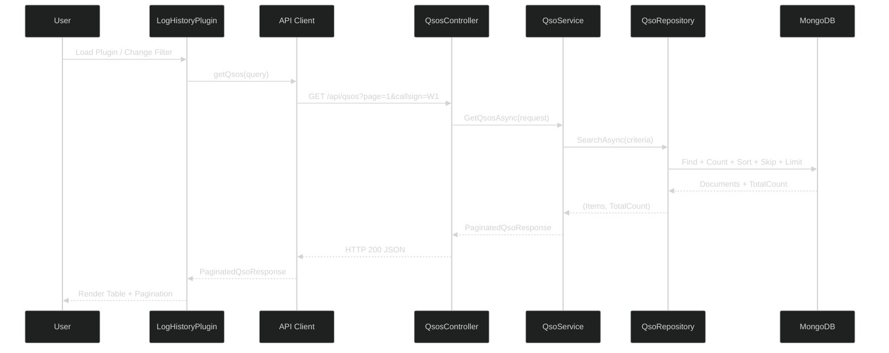
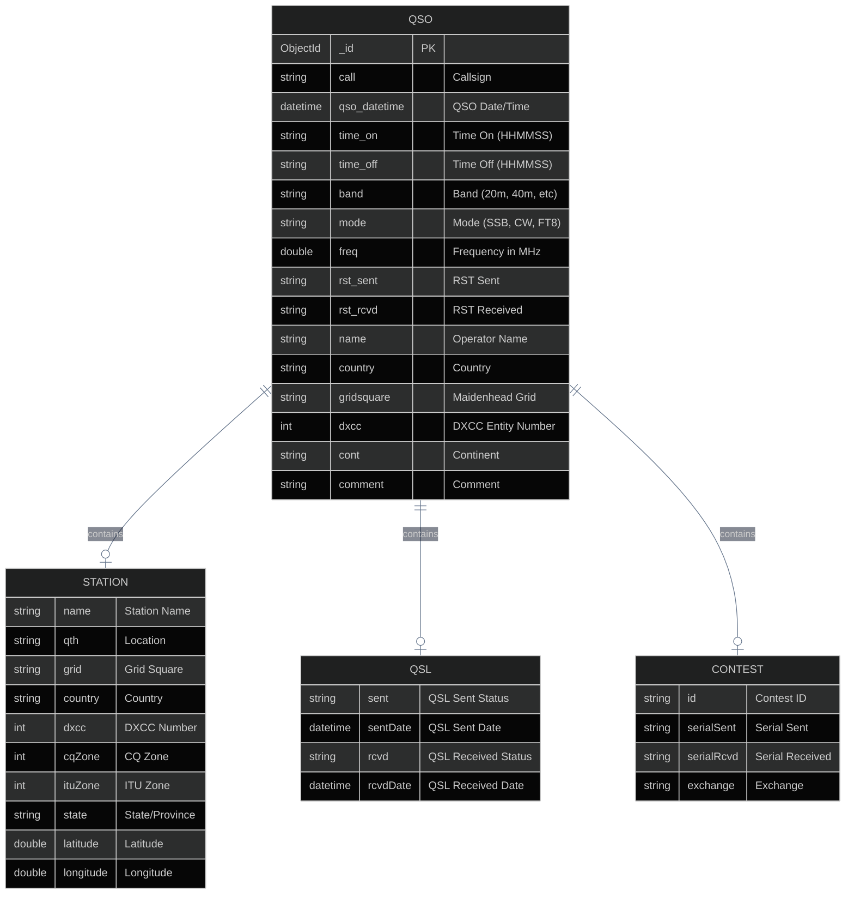

# Log History Plugin - Product Requirements Document

## Overview

The Log History plugin provides a comprehensive view of all QSO (contact) records stored in the Log4YM database. It features server-side pagination, advanced filtering, and real-time statistics display.

## Features Implemented

### Core Functionality

- **Paginated QSO Display**: Server-side pagination to efficiently handle large logbooks (tested with 3,940+ QSOs)
- **Search Capabilities**: Case-insensitive regex search on callsign and operator name
- **Filtering**: Filter by band, mode, and date range
- **Statistics Dashboard**: Real-time display of total QSOs, unique DXCC countries, unique grid squares, and today's contact count

### User Interface

```mermaid
%%{init: {'theme': 'dark', 'themeVariables': { 'primaryColor': '#6366f1', 'primaryTextColor': '#e2e8f0', 'primaryBorderColor': '#4f46e5', 'lineColor': '#64748b', 'secondaryColor': '#1e293b', 'tertiaryColor': '#0f172a'}}}%%
flowchart TB
    subgraph LogHistoryPlugin["Log History Plugin"]
        subgraph Header["Header Section"]
            Title[Plugin Title]
            Stats[QSO Count | DXCC Count]
        end

        subgraph Filters["Filter Bar"]
            CallsignSearch[Callsign Search]
            NameSearch[Name Search]
            BandDropdown[Band Filter]
            ModeDropdown[Mode Filter]
            DateToggle[Date Filters Toggle]
            ClearBtn[Clear Filters]
        end

        subgraph DateFilters["Collapsible Date Range"]
            FromDate[From Date]
            ToDate[To Date]
        end

        subgraph DataGrid["QSO Data Grid"]
            Columns[Date | Time | Callsign | Band | Mode | RST | Name | Country]
            Rows[Paginated QSO Rows]
        end

        subgraph Pagination["Pagination Controls"]
            PageInfo[Showing X - Y of Z]
            FirstPage[First]
            PrevPage[Previous]
            PageInput[Page Number]
            NextPage[Next]
            LastPage[Last]
        end

        subgraph StatsFooter["Statistics Footer"]
            TotalQSOs[Total QSOs]
            Countries[Countries]
            Grids[Grids]
            Today[Today]
        end
    end

    Header --> Filters
    Filters --> DateFilters
    DateFilters --> DataGrid
    DataGrid --> Pagination
    Pagination --> StatsFooter
```

## Architecture

### Backend Architecture (MVC + Service Layer)

```mermaid
%%{init: {'theme': 'dark', 'themeVariables': { 'primaryColor': '#6366f1', 'primaryTextColor': '#e2e8f0', 'primaryBorderColor': '#4f46e5', 'lineColor': '#64748b', 'secondaryColor': '#1e293b', 'tertiaryColor': '#0f172a'}}}%%
flowchart LR
    subgraph Client["React Frontend"]
        Plugin[LogHistoryPlugin.tsx]
        ApiClient[client.ts]
    end

    subgraph Controllers["ASP.NET Controllers"]
        QsosController[QsosController]
    end

    subgraph Services["Service Layer"]
        IQsoService[IQsoService]
        QsoService[QsoService]
    end

    subgraph Repositories["Data Access"]
        IQsoRepository[IQsoRepository]
        QsoRepository[QsoRepository]
    end

    subgraph Database["MongoDB Atlas"]
        QsoCollection[(qso Collection)]
    end

    Plugin -->|HTTP GET/POST| ApiClient
    ApiClient -->|/api/qsos| QsosController
    QsosController -->|DI| IQsoService
    IQsoService -.->|implements| QsoService
    QsoService -->|DI| IQsoRepository
    IQsoRepository -.->|implements| QsoRepository
    QsoRepository -->|MongoDB Driver| QsoCollection
```



### Data Flow



## API Endpoints

### GET /api/qsos

Retrieves paginated QSO records with optional filtering.

**Query Parameters:**

| Parameter | Type | Default | Description |
|-----------|------|---------|-------------|
| `callsign` | string | null | Filter by callsign (regex, case-insensitive) |
| `name` | string | null | Filter by operator name (regex, case-insensitive) |
| `band` | string | null | Filter by band (exact match) |
| `mode` | string | null | Filter by mode (exact match) |
| `fromDate` | DateTime | null | Filter QSOs on or after this date |
| `toDate` | DateTime | null | Filter QSOs on or before this date |
| `page` | int | 1 | Page number (1-indexed) |
| `pageSize` | int | 50 | Number of records per page |

**Response:**

```json
{
  "items": [
    {
      "id": "693ad44e310773e08dbb1449",
      "callsign": "K2CBI",
      "qsoDate": "2025-12-10T15:58:07Z",
      "timeOn": "155807",
      "timeOff": "160111",
      "band": "40m",
      "mode": "SSB",
      "frequency": 7.197,
      "rstSent": "59",
      "rstRcvd": "59",
      "station": {
        "name": "Michael H Weissman",
        "grid": null,
        "country": "United States",
        "dxcc": 291,
        "state": null,
        "continent": "NA",
        "latitude": null,
        "longitude": null
      },
      "comment": "hl1",
      "createdAt": "2025-12-11T14:24:39.267Z"
    }
  ],
  "totalCount": 3940,
  "page": 1,
  "pageSize": 50,
  "totalPages": 79
}
```

### GET /api/qsos/statistics

Returns aggregated statistics for the logbook.

**Response:**

```json
{
  "totalQsos": 3940,
  "uniqueCallsigns": 3030,
  "uniqueCountries": 209,
  "uniqueGrids": 2569,
  "qsosToday": 0,
  "qsosByBand": {
    "20m": 1093,
    "10m": 1269,
    "40m": 480,
    "15m": 278
  },
  "qsosByMode": {
    "SSB": 3330,
    "FT8": 330,
    "CW": 242
  }
}
```

### POST /api/qsos/search

Advanced search with request body for complex queries.

**Request Body:**

```json
{
  "callsign": "W1",
  "name": null,
  "band": "20m",
  "mode": null,
  "fromDate": "2025-01-01",
  "toDate": "2025-12-31",
  "dxcc": null,
  "limit": 50,
  "skip": 0
}
```

## Data Model

### QSO Document (MongoDB)



### BSON Field Mappings

The C# model uses `[BsonElement]` attributes to map to ADIF-compatible field names:

| C# Property | BSON Field | Description |
|-------------|------------|-------------|
| `Callsign` | `call` | Station callsign |
| `QsoDate` | `qso_datetime` | QSO timestamp |
| `TimeOn` | `time_on` | Start time |
| `TimeOff` | `time_off` | End time |
| `Frequency` | `freq` | Frequency in MHz |
| `RstSent` | `rst_sent` | RST sent |
| `RstRcvd` | `rst_rcvd` | RST received |
| `Grid` | `gridsquare` | Maidenhead locator |
| `Continent` | `cont` | Continent code |

## File Structure

```
src/
├── Log4YM.Server/
│   ├── Controllers/
│   │   └── QsosController.cs       # HTTP endpoints
│   ├── Services/
│   │   ├── IQsoService.cs          # Service interface
│   │   └── QsoService.cs           # Business logic
│   └── Core/
│       └── Database/
│           ├── QsoRepository.cs    # Data access
│           └── MongoDbContext.cs   # DB connection
├── Log4YM.Contracts/
│   ├── Api/
│   │   └── QsoDto.cs               # Request/Response DTOs
│   └── Models/
│       └── Qso.cs                  # Domain model
└── Log4YM.Web/
    └── src/
        ├── api/
        │   └── client.ts           # API client
        └── plugins/
            └── LogHistoryPlugin.tsx # React component
```

## Configuration

### MongoDB Connection

Connection string is stored in `appsettings.Development.json` (gitignored):

```json
{
  "MongoDB": {
    "ConnectionString": "mongodb+srv://...",
    "DatabaseName": "Log4YM"
  }
}
```

Production placeholder in `appsettings.json`:

```json
{
  "MongoDB": {
    "ConnectionString": "mongodb://localhost:27017",
    "DatabaseName": "Log4YM"
  }
}
```

## Testing

### Manual Test Cases

1. **Pagination**: Navigate through pages, verify correct page count
2. **Callsign Search**: Search for "W1" should return all W1xxx callsigns
3. **Name Search**: Search for partial name matches
4. **Band Filter**: Select "20m" to show only 20m contacts
5. **Mode Filter**: Select "FT8" to show only FT8 contacts
6. **Date Range**: Filter by date range
7. **Combined Filters**: Apply multiple filters simultaneously
8. **Clear Filters**: Reset all filters to default

### API Testing with cURL

```bash
# Get paginated QSOs
curl "http://localhost:5001/api/qsos?page=1&pageSize=10"

# Search by callsign
curl "http://localhost:5001/api/qsos?callsign=W1&page=1&pageSize=10"

# Get statistics
curl "http://localhost:5001/api/qsos/statistics"

# Health check
curl "http://localhost:5001/api/health"
```

## Future Enhancements

- [ ] Column sorting (click headers to sort)
- [ ] Column visibility toggles
- [ ] Export to ADIF format
- [ ] Bulk delete functionality
- [ ] QSO detail modal on row click
- [ ] Keyboard navigation
- [ ] Virtual scrolling for large datasets
- [ ] Saved filter presets
