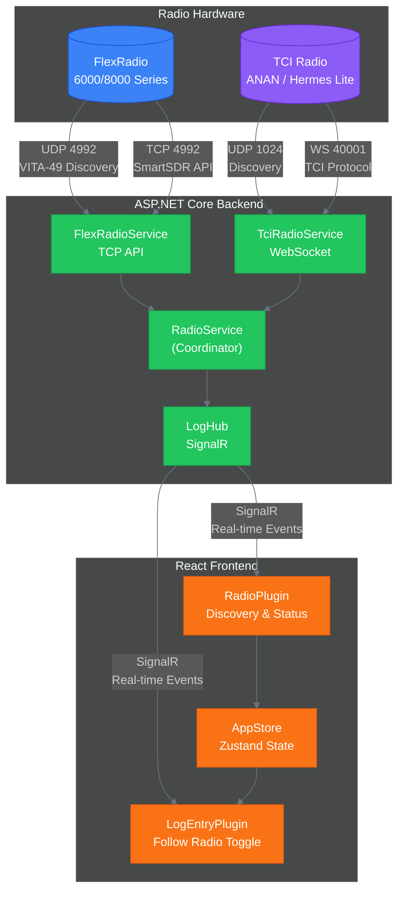
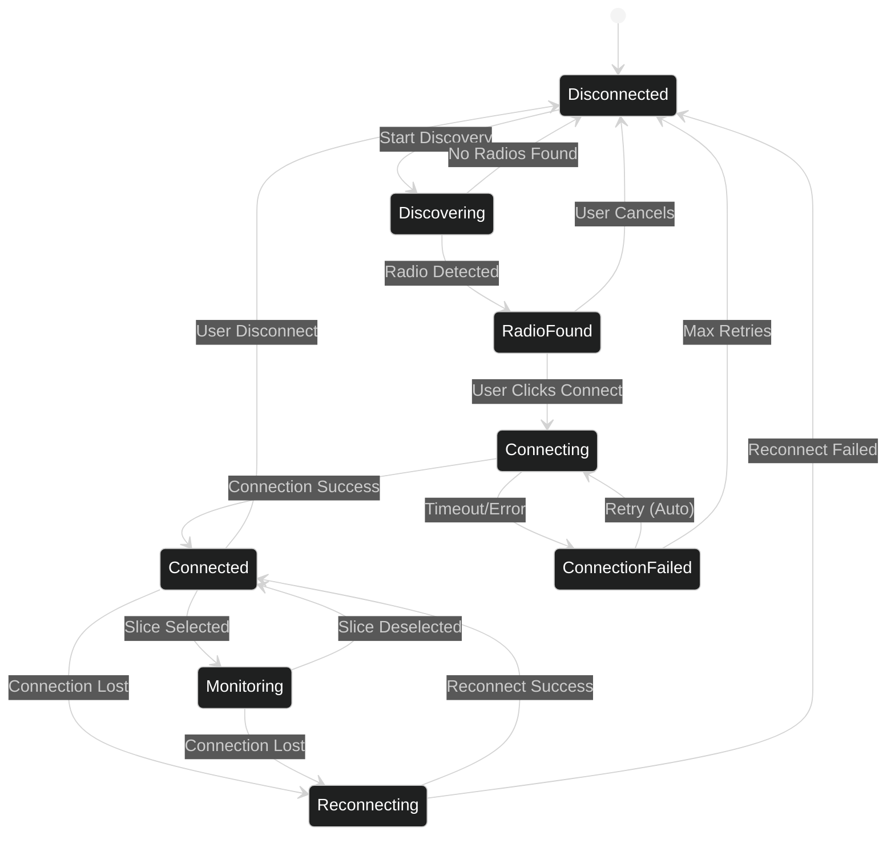
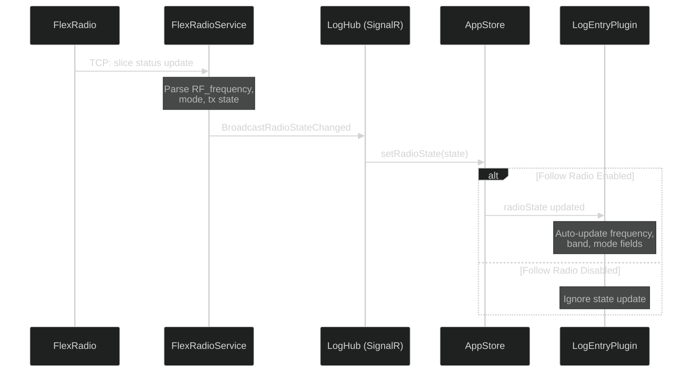
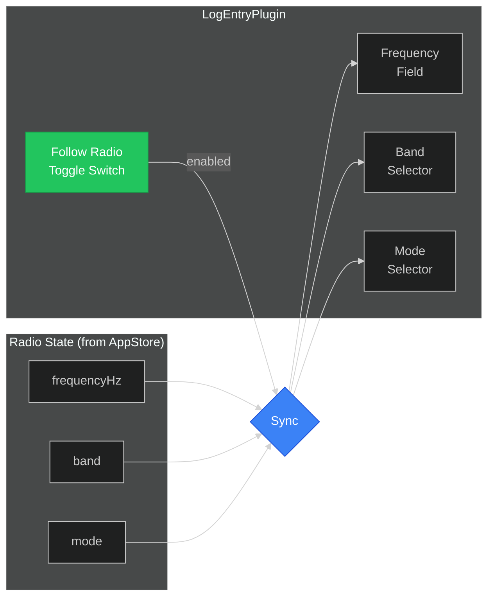
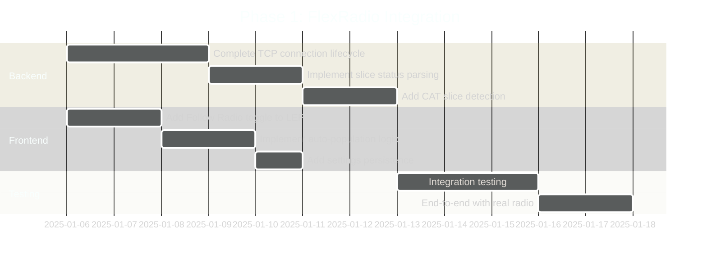

# Radio Integration PRD

**Version:** 1.0
**Author:** Log4YM Development Team
**Date:** 2025-12-16
**Status:** Draft

---

## Executive Summary

This PRD defines the requirements for integrating amateur radio transceiver control into Log4YM. The Radio Plugin enables automatic frequency, mode, and band tracking from connected radios, eliminating manual data entry during logging.

**Phase 1** focuses on FlexRadio integration via the SmartSDR TCP API.
**Phase 2** adds TCI protocol support for ANAN, Thetis, and Hermes Lite radios.

The integration provides real-time radio state synchronization to the LogEntryPlugin through a "Follow Radio" toggle, automatically populating QSO frequency, band, and mode fields.

---

## Background

### Current State

Log4YM currently supports:
- Manual frequency/band/mode entry in LogEntryPlugin
- Basic FlexRadioService with UDP discovery (port 4992) and TCP connection
- TciRadioService with UDP discovery (port 1024) and WebSocket connection
- RadioPlugin UI with FlexRadio/TCI radio type selection and inline discovery

### Problem Statement

Amateur radio operators frequently switch frequencies and modes during operating sessions. Manual entry of this data into logging software is:
1. Time-consuming and interrupts operating flow
2. Error-prone, especially during contests or pileups
3. Inconsistent when operators forget to update fields

### Solution Overview

Automatic radio tracking eliminates these issues by:
- Discovering radios on the local network
- Maintaining persistent connections with real-time state updates
- Pushing frequency/mode changes to the logging interface
- Providing a user-controlled toggle to enable/disable auto-population

---

## Architecture Overview



---

## Radio Type Comparison

| Feature | FlexRadio (Phase 1) | TCI Radio (Phase 2) |
|---------|---------------------|---------------------|
| **Target Radios** | FLEX-6000, 8000 series | ANAN, Thetis, Hermes Lite |
| **Discovery** | UDP 4992 (VITA-49) | UDP 1024 |
| **Connection** | TCP (plain text) | WebSocket |
| **Default Port** | 4992 | 40001 |
| **Frequency Format** | `RF_frequency=14.250` (MHz) | `vfo:0,14250000;` (Hz) |
| **Mode Format** | `mode=USB` | `modulation:0,USB;` |
| **Multi-receiver** | Slices (0-7) | Receivers (0-n) |
| **CAT Integration** | SmartSDR / SmartCAT | Native TCI |

---

## Objectives

### Primary Goals

| ID | Objective | Success Metric |
|----|-----------|----------------|
| O1 | FlexRadio CAT slice tracking | Frequency updates within 100ms of radio change |
| O2 | Automatic log field population | 95% reduction in manual frequency entry |
| O3 | Seamless discovery experience | One-click connection after initial setup |
| O4 | Reliable connection management | Auto-reconnect within 5 seconds of disconnect |

### Non-Goals (Phase 1)

- TX/PTT control from Log4YM
- Multi-radio simultaneous connections
- Direct rig control (frequency changes from software)
- Omni-Rig or Hamlib integration

---

## User Stories

### US-1: Radio Discovery
**As a** FlexRadio operator
**I want to** discover my radio on the network
**So that** I can connect without manual IP configuration

**Acceptance Criteria:**
- RadioPlugin displays discovered radios within 3 seconds
- Radio list shows model, nickname, IP address
- Refresh button triggers new discovery scan

### US-2: Radio Connection
**As a** radio operator
**I want to** connect to my discovered radio
**So that** Log4YM can track my frequency and mode

**Acceptance Criteria:**
- Single click connects to selected radio
- Connection status displayed (Disconnected/Connecting/Connected/Monitoring)
- Error messages shown for connection failures

### US-3: Follow Radio Toggle
**As a** logger
**I want to** toggle automatic frequency tracking
**So that** I can control when the log entry updates

**Acceptance Criteria:**
- Toggle visible in LogEntryPlugin header
- When enabled, frequency/band/mode auto-update from radio
- When disabled, fields remain editable but static
- Toggle state persists across sessions

### US-4: Multi-Slice Radio Handling
**As a** FlexRadio operator with multiple slices
**I want** Log4YM to track only my CAT-designated slice
**So that** logging reflects my transmit frequency

**Acceptance Criteria:**
- Only the CAT slice (exposed by SmartSDR/SmartCAT) is tracked
- Slice changes in SmartSDR are reflected in Log4YM
- Other slices are ignored for logging purposes

---

## Technical Design

### FlexRadio Protocol Details

```
Discovery (UDP 4992):
+-- VITA-49 discovery packets broadcast
+-- Parse: model, serial, nickname, IP, version
+-- Radios respond every ~3 seconds

Connection (TCP):
+-- Connect to radio IP on discovered port
+-- Send: "sub slice all" (subscribe to slice updates)
+-- Receive: slice status messages
+-- Parse: RF_frequency, mode, tx (TX state)
```

**Slice Status Message Format:**
```
S<handle>|slice <num> RF_frequency=<MHz> mode=<mode> tx=<0|1> ...
```

### Radio Connection State Machine



### Data Flow: Radio to Log Entry



### LogEntryPlugin Integration



---

## FlexRadio CAT Slice Handling

FlexRadio supports multiple simultaneous slices (virtual receivers). Log4YM tracks only the **CAT slice** which is:

| Platform | CAT Slice Source |
|----------|------------------|
| **macOS** | SmartSDR designates active slice |
| **Windows** | SmartCAT exposes CAT-connected slice |

**Detection Strategy:**
1. Subscribe to all slices: `sub slice all`
2. Monitor for `tx=1` state to identify transmit slice
3. Use the TX slice as the logging source
4. Fall back to Slice A (slice 0) if no TX designation

---

## Configuration

### Inline Configuration (RadioPlugin)

The radio connection is configured inline within the RadioPlugin:

1. **Select Radio Type** - FlexRadio or TCI (different protocols)
2. **Discovery** - Scans network for available radios
3. **Select Radio** - Choose from discovered radios
4. **Connect** - Establish connection
5. **Select Slice/Instance** - Choose which receiver to track

### Persistent Settings

```typescript
interface RadioSettings {
  lastRadioType: 'FlexRadio' | 'Tci';
  lastConnectedRadioId: string | null;
  autoConnect: boolean;
  followRadioEnabled: boolean;
}
```

---

## Implementation Plan

### Phase 1: FlexRadio Integration



#### Tasks

| Task | Description | Priority |
|------|-------------|----------|
| FLEX-1 | Complete FlexRadioService TCP connection lifecycle | P0 |
| FLEX-2 | Parse slice status (RF_frequency, mode, tx) | P0 |
| FLEX-3 | Implement CAT slice detection (TX slice tracking) | P0 |
| LEP-1 | Add Follow Radio toggle to LogEntryPlugin header | P0 |
| LEP-2 | Subscribe to radioState and auto-populate fields | P0 |
| LEP-3 | Persist followRadio setting | P1 |
| TEST-1 | Test with real FlexRadio hardware | P0 |

### Phase 2: TCI Protocol Support (Future)

| Task | Description | Priority |
|------|-------------|----------|
| TCI-1 | Update TciRadioService WebSocket to use port 40001 | High |
| TCI-2 | Implement TCI command parsing | High |
| TCI-3 | Update RadioPlugin for TCI-specific config | Medium |
| TCI-4 | Test with Thetis, ANAN, Hermes Lite | High |

---

## Error Handling

| Error Condition | Recovery Action |
|-----------------|-----------------|
| Discovery timeout | Show "No radios found" with retry button |
| Connection refused | Display error, offer manual IP entry |
| Connection lost | Auto-reconnect with exponential backoff |
| Parse error | Log warning, continue with last known state |
| Invalid frequency | Ignore update, maintain previous value |

---

## Testing Strategy

### Unit Tests
- FlexRadioService message parsing
- Frequency-to-band conversion
- State machine transitions

### Integration Tests
- End-to-end discovery flow
- SignalR event propagation
- RadioContext state synchronization

### Manual Testing Checklist

- [ ] Discover FlexRadio on local network
- [ ] Connect and verify status indicator
- [ ] Change frequency on radio, verify LogEntry updates
- [ ] Change mode on radio, verify LogEntry updates
- [ ] Toggle Follow Radio off, verify fields don't update
- [ ] Disconnect radio, verify graceful handling
- [ ] Reconnect after network interruption
- [ ] Multi-slice: verify only CAT/TX slice tracked

---

## Open Questions

1. **Q:** Should Follow Radio toggle persist per-radio or globally?
   **A:** Globally - simpler UX, most operators want consistent behavior.

2. **Q:** How to handle SO2R (two-radio) setups?
   **A:** Deferred. May require separate LogEntry widgets per radio.

3. **Q:** Should we display non-tracked slices for reference?
   **A:** Future enhancement - show all slices with "tracking" indicator.

---

## References

- [FlexRadio SmartSDR TCP/IP API](https://community.flexradio.com/discussion/8031488/smartsdr-tcp-ip-api-frequency)
- [FlexRadio Developer Program](https://www.flexradio.com/api/developer-program/)
- [TCI Protocol - maksimus1210](https://github.com/maksimus1210/TCI)
- [TCI Protocol - ExpertSDR3](https://github.com/ExpertSDR3/TCI)
- [K3TZR xLib6000](https://github.com/K3TZR/xLib6000)
